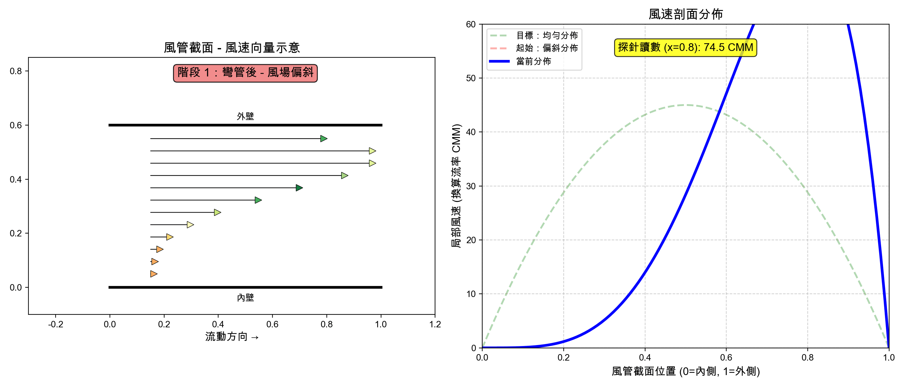

# Wind Duct CFD Simulation

90 度彎管風場 CFD 模擬動畫，展示為什麼彎管後的風速測量會偏高。

## 互動式模擬

**[點此開啟 CFD 互動模擬](https://seikaikyo.github.io/wind/cfd_interactive.html)**

- 真實 CFD 計算資料 (Navier-Stokes, Re=150, 120×120 網格)
- 粒子流動動畫
- 即時偏差百分比顯示
- 拖動滑軌沿管道移動探針

## 模擬結果

### CFD 模擬動畫 (Navier-Stokes 求解)


**特色：**
- 真正的 CFD 計算：求解 Navier-Stokes 方程
- 三種流動視覺化效果：
  - 白色粒子追蹤
  - LIC (Line Integral Convolution) 紋理
  - 流線箭頭
- 展示離心力效應：外壁高速（紅色）、內壁低速（藍色）

### 速度剖面動畫



展示風場從偏斜分佈逐漸發展成均勻分佈的過程。

### 粒子流動動畫


直觀展示粒子在不同區域的速度變化。

## 物理原理

當氣流通過 90 度彎管時：

1. **離心力效應**：氣流被「甩」向外壁
2. **位置 1（彎管後）**：速度分佈不均勻，外壁高速、內壁低速
3. **位置 2（直管段）**：經過足夠距離後，風場恢復均勻

這解釋了為什麼在彎管後測量會得到偏高的風速讀數。

## 使用方式

### 互動式模擬 (HTML5)

直接用瀏覽器開啟 `cfd_interactive.html`，或訪問 [GitHub Pages](https://seikaikyo.github.io/wind/cfd_interactive.html)。

### CFD 模擬（Python）

```bash
# 生成 GIF
python duct_cfd_real.py -f gif

# 生成 MP4
python duct_cfd_real.py -f mp4

# 匯出 CFD 資料供 HTML 使用
python export_cfd_data.py
```

### 速度剖面動畫

```bash
python duct_velocity_animation.py -f gif
python duct_velocity_animation.py -f mp4
```

## 技術細節

### CFD 求解器 (Python)

- **方程式**：2D 穩態 Navier-Stokes 方程
- **算法**：SIMPLE (Semi-Implicit Method for Pressure-Linked Equations) 簡化版
- **離散化**：有限差分法
  - 對流項：上風差分
  - 擴散項：中央差分
- **網格**：120 x 120
- **雷諾數**：Re = 150

### 互動式模擬 (HTML5/JavaScript)

- **資料來源**：載入 Python CFD 計算結果 (cfd_data.json)
- **視覺化**：Canvas 2D 熱圖 + 粒子追蹤
- **互動**：滑軌控制探針位置，即時更新讀數

### 邊界條件

- **入口**：拋物線速度分佈 (Dirichlet)
- **出口**：零梯度 (Neumann)
- **壁面**：無滑移 (No-slip)

## 依賴套件

Python 版本：
```bash
pip install numpy matplotlib scipy
```

可選（用於 MP4 輸出）：
```bash
brew install ffmpeg  # macOS
```

HTML 版本無需安裝任何套件，直接用瀏覽器開啟即可。

## 檔案說明

| 檔案 | 說明 |
|------|------|
| `cfd_interactive.html` | **CFD 互動模擬** |
| `cfd_data.json` | CFD 計算結果資料 |
| `duct_cfd_real.py` | CFD 模擬主程式 (Navier-Stokes) |
| `export_cfd_data.py` | 匯出 CFD 資料為 JSON |
| `duct_velocity_animation.py` | 速度剖面動畫 |
| `duct_cfd_simulation.py` | 簡化版 CFD 模擬 |

## License

MIT
